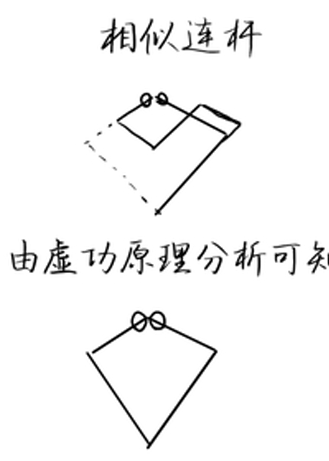
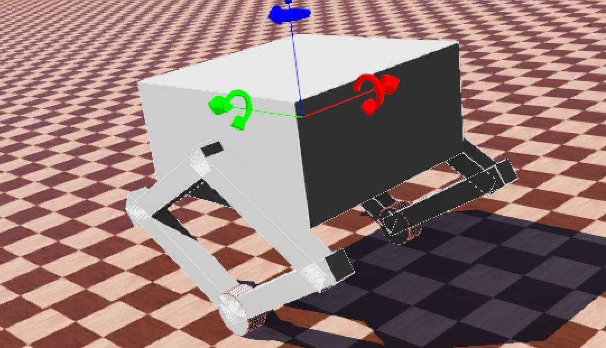

# 我能在痴呆症的情况下通关轮腿电控吗
***
## 理论
[轮腿圣经1](https://zhuanlan.zhihu.com/p/563048952) 本篇是轮腿整体的架构，包括运动学分析、VMC、LQR、转向控制、腿长控制、Roll补偿等  
[轮腿圣经2](https://zhuanlan.zhihu.com/p/613007726) 本篇主要是更加详细的运动学分析与VMC  
控制理论： [LQR](https://www.bilibili.com/video/BV1dm4y177tA) 、 [卡尔曼滤波](https://www.bilibili.com/video/BV1ez4y1X7eR)  
前置依赖： 线性代数、概率论、信号分析、经典力学、虚功定理  
推荐阅读：控制之美1、2  
  

当初次尝试阅读上面的文章，即使看完了也许也还有一个疑问：为什么要用到这些知识？  

我以个人狭隘的理解做一些简单的解释：原本的轮腿有多个关节，如果直接对其进行解算，结果可能非常复杂，但如果我们将腿简化成一个杆，那么它便可以简化为一个二阶倒立摆问题，而LQR就是一种经典的对于倒立摆问题的控制解法。  

但这里又会遇到一个问题，我们用LQR计算需要的状态变量有theta及其变化量，这些量怎么算呢？LQR算出来的轮子的力矩可以直接用，但是杆的力矩并不对应关节电机的力矩，怎么处理呢？这时就需要VMC_1根据电机角度与机体pitch大小计算出theta与一些VMC_2需要的量，VMC_2则计算出将整个等效杆的力矩分解到两个关节电机上。 

至于卡尔曼滤波，则是因为我们计算LQR时需要较为精确的x与v，如果直接计算轮毂电机编码器而不经过滤波，则一是可能会有毛刺，二是无法处理轮子打滑空转的情况，一旦x、v不准，LQR计算就可能出现偏差，导致轮腿发疯。使用卡尔曼滤波融合轮子编码器与机体加速度，便可尽量减少上述情况。  

剩下的转向控制、横滚角补偿、腿长控制、防劈叉控制，都是通过PID实现的，因为这些变量并未放在LQR的状态变量中（放入会导致LQR过于复杂），想要控制这些变量稳定便需要在LQR的输出基础上加上PID的输出了。  

所以轮腿的控制流程大概如下：  

> 卡尔曼滤波计算x、v；VMC_1计算theta、pitch -> LQR计算等效杆力矩 -> VMC_2将力矩分解至电机 -> 加上其他控制量的PID输出 -> 电机输出力矩
  
***
## 仿真

本人在完成理论学习后直接开始在webots上进行建模仿真，由于串联腿的关节连接较为复杂，于是参考交大机械开源中的说明，将串联腿等效为菱形四杆进行建模。

  

建模时注意一个问题：将一边建好的腿复制到另一边时需要将电机转轴旋转180°，保持与真实电机相同的力作用方向一致，否则将仿真代码用于真实机器时又要改一堆正负号。  

  

此外还需要注意陀螺仪、IMU、加速度计的摆放方向与真实机器一致。

完成仿真迁移到真实机器上时还需要注意关节电机编码器零位，代码中的编码器offset可能需要修改。（真实机器的关节电机编码器建议以竖直向下为零位，这样无论哪个电机offset都是90°，但建模时可能不一定能做到offset是90°）

***
## 调试

写完代码只是第一步，更重要的是如何调参实现轮腿需要的功能，而代码里光LQR就有12个参数（矩阵运算前是8个），还有4个PID的参数，我们该按什么顺序调这些参数呢？  

### ① 一阶倒立摆

将LQR的K矩阵第二行全置0，两个关节电机改为位置速度模式控制，保持在一个固定角度，只用LQR控制轮毂电机，此时轮腿等效为一阶倒立摆。  

这一步主要是为了确定各状态变量与K矩阵的极性（即正负），须保证 LQR_K[i] * err[i] 的6项结果都是同号的，不同则在LQR计算式中对应项加减负号。(注意部分状态变量的左右腿的极性不一样)（该极性与电机力矩为正的方向、IMU摆放的方向等都有关，可能与别人代码中不一致，需要检查）  

极性正确后大概率可以实现基本稳定站立。

### ② 二阶倒立摆

将两个关节电机改回MIT模式，在上面的基础上用LQR控制关节电机。  

这一步也是确定极性。将K矩阵第二行的后四个置为0，此时车子前倾，腿往前蹬，车子往后倾，腿往后蹬。将前4个置为0，此时车子往前倾，腿会往后蹬，车子往后倾，腿会往前蹬，如果参数合适，此时是可以实现基本平衡的。  

剩下位移与速度极性。大致来说，关节电机的位移项的极性与速度项一致，关节电机的速度项的极性与PitchR的极性一致。

### ③ 基本稳定站立

确认了每个极性后，便可以将所有置0项恢复，开始调LQR的Q、R矩阵了。个人经验来说，Q矩阵中theta项、pitch项、速度项更重要，需要必其他三项更大的值。  

调好参数实现在无控制信号情况下实现基本稳定站立后可以进入下一步。

### ④ 稳定行走

加上腿长的PID控制，PID参数保持一个较保守的值（腿长稳定住不要抖动才是关键，至于腿长和设定值的差没有那么重要），可能还需要修改LQR参数才能实现稳定行走。  

同时注意控制信号不要有过高的加速度，不然大概率失控。

完成上面后再加上Roll补偿与防劈叉PID，这两项的效果不一定有那么直观，但是一定要确认正负！

### ⑤ 旋转

加上转向PID，如果上一步LQR参数或者腿长PID参数没调好，可能会出现LQR的输出轮毂电机力矩尝试去补偿转向PID的输出力矩，导致无法旋转，且转向力矩超过一定值可能会失控。  

（本人卡在旋转这非常久，后面发现是腿长PID的问题，注意移动时腿长一定要稳定住，否则大概率到不了这一步）

注意转向PID正负，如果错了它会一直旋转。

刚实现旋转的时候可能会出现旋转的时候一卡一卡的，这与设置的旋转速度、转向PID参数、LQR参数、腿长PID参数都可能有关。

### ⑥ 离地检测与跳跃

 还没做到这捏

### ⑦ 倒地自救

 还没做到这捏